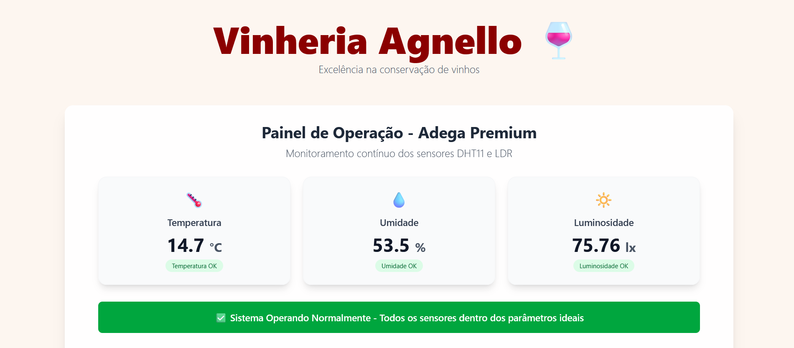
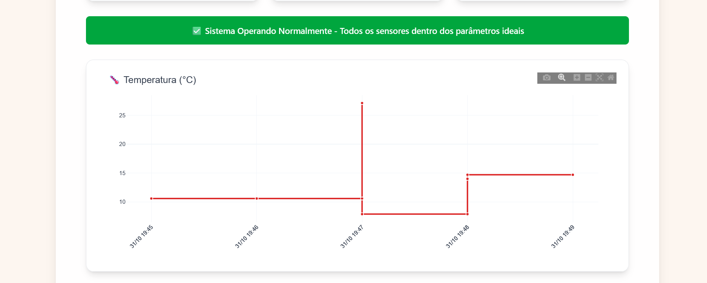
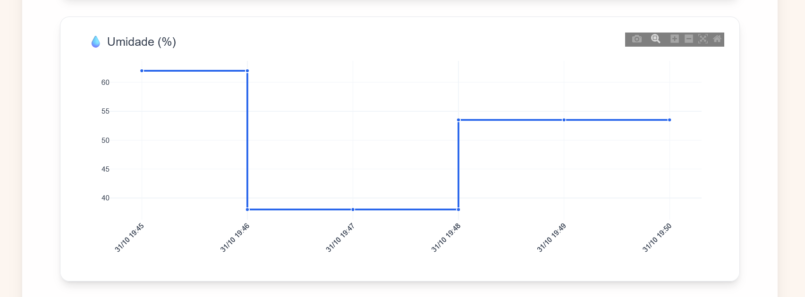
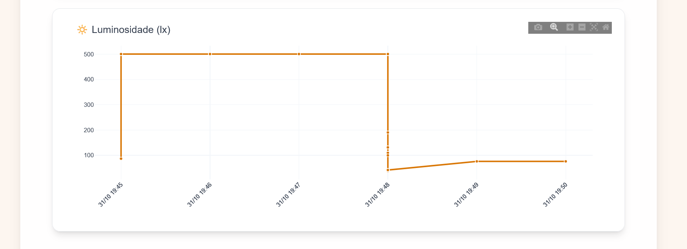

# 🍷 Vinheria Agnello - Sistema de Monitoramento de Adega

## 🧠 Descrição do Projeto

Este projeto faz parte do **Checkpoint 6 de Engenharia de Software (Edge Computing & Computer Systems)** e tem como objetivo automatizar o monitoramento de uma **vinheria inteligente**, controlando **luminosidade, temperatura e umidade** em tempo real, utilizando **sensores conectados ao ESP32** , integração via **MQTT** e **Dashboard** web.  


🔗 **Simulação completa no Wokwi:**  
👉 [Clique aqui para visualizar o projeto](https://wokwi.com/projects/445739856246688769)

---

## ⚙️ Funcionalidades

- 📡 Conexão automática com **Wi-Fi** e **broker MQTT**  
- 🌡️ Leitura de **temperatura e umidade (DHT22)**  
- 💡 Monitoramento de **luminosidade (LDR)**   
- 📊 Dashboard em tempo real com gráficos e indicadores visuais
- 🔁 Atualização automática dos dados a cada 5 segundos
- 🚨 Sistema de alertas com banners rotativos indicando condições fora do ideal

---

## 🛠️ Tecnologias Utilizadas

### 🖥️ Front-end
- React.js + Vite
- Plotly.js → Gráficos interativos
- Axios → Requisições HTTP
- Moment.js → Manipulação de datas
- Tailwind CSS → Estilização responsiva

### Backend/Hardware
- ESP32 → Microcontrolador principal
- DHT22 → Sensor de temperatura e umidade
- LDR → Sensor de luminosidade
- MQTT → Protocolo de comunicação
- FIWARE Orion Context Broker → Gerenciamento de entidades IoT
- FIWARE STH-Comet → Armazenamento histórico de dados

---

## 🧩 Componentes Utilizados

| Componente         | Função Principal                      | Pino ESP32 |
|--------------------|---------------------------------------|-------------|
| **DHT22**          | Sensor de temperatura e umidade        | 4           |
| **LDR**            | Sensor de luminosidade                 | 34 (ADC)    |
| **ESP32**          | Microcontrolador principal             | —           |

---

### 📤 Publicação (Publish)

| Tópico | Dado Enviado |
|--------|---------------|
| `/TEF/device007/attrs/l` | Luminosidade (lux) |
| `/TEF/device007/attrs/t` | Temperatura (°C) |
| `/TEF/device007/attrs/u` | Umidade (%) |

---

### ⚙️ Configurações do Sistema

| Parâmetro | Valor | Descrição |
|-----------|-------|-----------|
| Atualização | 5 segundos | Frequência de polling |
| Histórico | 500 pontos | Máximo nos gráficos |
| Amostras | Últimas 20 | Dados recentes |
| Fuso Horário | America/Sao_Paulo | Localização |

### 🎯 Limites de Operação Ideal

| Parâmetro | Mínimo | Máximo | Unidade | Impacto |
|-----------|--------|--------|---------|---------|
| **Temperatura** | 10°C | 18°C | °C | Conservação dos vinhos |
| **Umidade** | 50% | 70% | % | Preservação de rolhas e rótulos |
| **Luminosidade** | 60 | 100 | lx | Envelhecimento controlado |

---

## 🚨 Sistema de Alertas
O sistema avalia continuamente os dados recebidos e emite alertas visuais rotativos no dashboard:
- 🔥 Temperatura fora dos limites ideais
- 💧 Umidade excessiva ou insuficiente
- 💡 Luminosidade inadequada para a conservação

## 🔄 Fluxo de Dados
1. **Coleta**: Sensores capturam dados a cada 5 segundos
2. **Transmissão**: Dados enviados via MQTT para o broker
3. **Armazenamento**: FIWARE armazena no STH-Comet
4. **Consulta**: Frontend busca últimos 20 registros
5. **Visualização**: Gráficos e cards atualizados em tempo real

---

## 🚀 Como Executar

### ✅ Passo 1 — Acesse o projeto online
Abra o simulador no Wokwi:  
🔗 [https://wokwi.com/projects/445739856246688769](https://wokwi.com/projects/445739856246688769)

### ✅ Passo 2 — Configure o Wi-Fi e Broker MQTT:
O código já utiliza o Wi-Fi padrão do Wokwi:
```
const char* default_SSID = "Wokwi-GUEST";
const char* default_PASSWORD = ""
```
🌐 Configuração do Servidor:
```
const char* BROKER_MQTT = "107.23.174.107";
const int BROKER_PORT = 1883;
```
**Nota sobre o servidor**:
O broker MQTT 107.23.174.107 é um servidor de demonstração temporário que pode não estar sempre disponível

✅ Passo 3 — Inicie a simulação

Clique em “Start Simulation” no wokwi

### Front-end 
```
# Clone o repositório
git clone [url-repositorio]
cd dashboard-agnello

# Instalação de dependências
npm install

# Execução em desenvolvimento
npm run dev
```


## 📸 Screenshots do Sistema


*Interface principal mostrando monitoramento contínuo dos sensores*



*Gráficos Plotly.js com histórico de temperatura, umidade e luminosidade*

👥 Autores

Equipe:

Ana Clara Rocha de Oliveira – RM: 564298<br>
Deivid ruan Marques – RM: 566356<br>
Felipe Cordeiro - RM: 566518<br>
Matheus von koss wildeisen - RM: 561539<br>
Larissa Shiba Felix - RM: 560462<br>

📚 Projeto acadêmico — Engenharia de Software (Edge Computing)